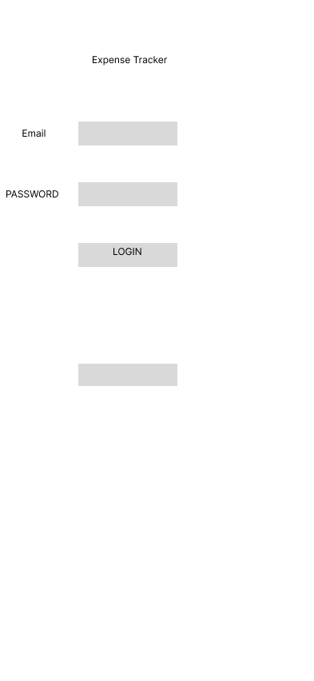
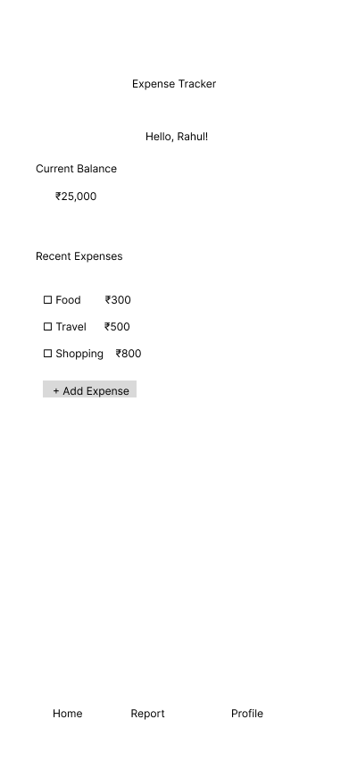
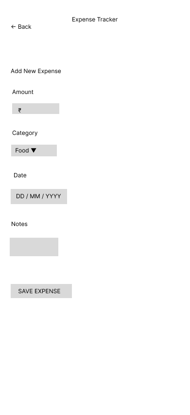
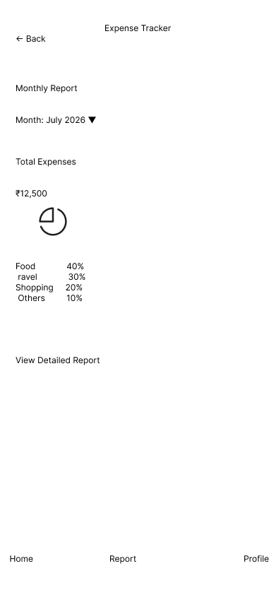

# 📱 Mobile App Wireframing – Expense Tracker

## 📖 Project Overview

This project presents the low-fidelity wireframes of an **Expense Tracker Mobile Application** created using **Figma**. The objective is to demonstrate the early stages of mobile application design by following the **Design Thinking Process**, conducting basic user research, creating a user persona, and designing user flows before actual development.

---

## 🎯 Objectives

- Conduct basic user research
- Create a user persona
- Design a user flow
- Create low-fidelity mobile wireframes
- Apply the Design Thinking process

---

## 🛠️ Tool Used

- Figma

---

## 📱 Wireframes

### 1. Login Screen

Allows users to log in or create a new account.



---

### 2. Dashboard

Displays the user's current balance and recent expenses.



---

### 3. Add Expense

Allows users to add a new expense by entering the amount, category, date, and notes.



---

### 4. Reports

Displays monthly expense analysis with category-wise spending and a pie chart placeholder.



---

## 👤 User Persona

**Name:** Rahul Kumar

**Age:** 20 Years

**Occupation:** Student

### Goals

- Track daily expenses
- Save money
- Monitor monthly spending

### Pain Points

- Forgetting daily expenses
- Difficulty managing personal finances
- Existing apps are too complicated

---

## 🔄 User Flow

```text
Open App
    ↓
Login
    ↓
Dashboard
    ↓
Add Expense
    ↓
Save Expense
    ↓
Updated Dashboard
    ↓
View Reports
```

---

## 💡 Design Thinking Process

### Empathize
Understand the challenges users face while managing daily expenses.

### Define
Identify the need for a simple and efficient expense tracking application.

### Ideate
Design an application with easy navigation and quick expense management.

### Prototype
Create low-fidelity wireframes using Figma.

### Test
Gather user feedback and improve the application design.

---

## 📂 Repository Contents

- 📄 Expense_Tracker_Wireframes.pdf
- 🖼️ Login Wireframe
- 🖼️ Dashboard Wireframe
- 🖼️ Add Expense Wireframe
- 🖼️ Reports Wireframe
- 📄 README.md

---

## 📌 Expected Outcome

This project demonstrates the planning and design phase of a mobile application by creating user-centered low-fidelity wireframes. These wireframes provide a clear structure for future UI design and application development.

---

## 👨‍💻 Author

**Manoj**

B.Tech Student
